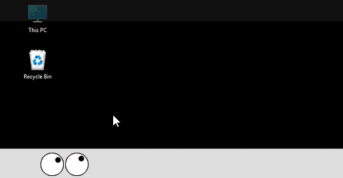

# MouseEyes – Official Downloads

MouseEyes is a Windows desktop utility that displays animated eyes which track your mouse across one or more monitors. Never lose your mouse again. Never have to shake your mouse in hopes of finding it. 

## Official Website
https://www.MouseEyes.com

## Downloads
Official, signed Windows installers are available on the **Releases** page of this repository.

➡️ [https://github.com/MouseEyes/MouseEyes-Downloads/releases](https://github.com/MouseEyes/MouseEyes-Downloads/releases)

This repository exists solely to distribute verified MouseEyes installers.
